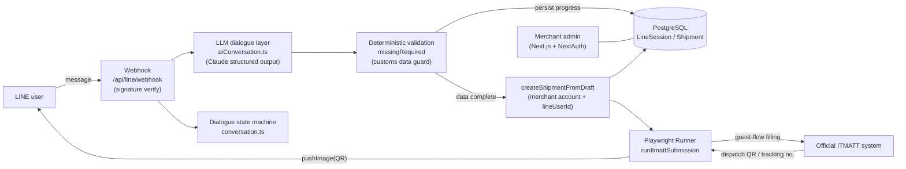

# EZPOST ITMATT Conversational Filing System

[繁體中文](README.md) ｜ **English**

Replace the tedious international-mail customs declaration form with a single LINE conversation. The system uses an LLM to understand the user's natural language, extracts the customs fields, validates them deterministically, then uses browser automation to fill the official ITMATT international-mail declaration system on the user's behalf. The generated dispatch QR code is sent back to the user in LINE, who scans it at the post office to print and ship.

This is a personal project with no affiliation to any postal operator; ITMATT is a public international-mail electronic clearance service.

## Demo

The screenshots below show the full conversational filing flow in LINE: starting a shipment, collecting sender and recipient details, package information, pre-submission confirmation, and receiving the dispatch QR code.


> Disclaimer: All sender, recipient, address, phone, and item details shown are fictional test data and contain no real personal information; the QR code in the screenshots has been masked.

## Motivation

International-mail customs declaration (ITMATT) requires the sender to fill in sender, recipient, and per-item customs details field by field, in English, following each field's character and format constraints. For non-expert senders this creates several pain points:

- Numerous fields: destination country, state/province, postal code, HS code, country of origin, content category, and more.
- Low error tolerance: incorrect declaration data can cause the item to be returned or even confiscated at the destination customs.
- A high-friction, error-prone experience for ordinary consumers.

The goal is to change the entry point from "a complex multi-page form" into "a natural conversation," where the system handles understanding, aggregation, automated filling, and validation.

## How It Works

```
LINE user
   │  natural-language conversation
   ▼
LLM field extraction (Claude structured output)
   │
   ▼
Deterministic validation (only complete, valid data passes)
   │
   ▼
Playwright fills ITMATT (guest flow) → submit
   │
   ▼
Capture dispatch QR / tracking number → send back to LINE → scan & print at post office
```

1. After the user selects a mail type, they first read the notice for that type and reply to agree before data collection begins.
2. The user answers in natural language; the LLM progressively extracts sender, recipient, content category, weight and dimensions, and per-item details.
3. Before submission, a deterministic validation layer checks all required fields; only after it passes does the browser automation walk the ITMATT guest flow to fill and submit.
4. The generated dispatch QR and tracking number are captured and pushed back to the user's LINE.

## Architecture



## Key Design Decisions

- **Hybrid architecture: LLM understanding + rule-based guarding.** The LLM (Claude structured output) handles understanding natural language and extracting fields, providing a friendly conversational experience; but at the low-tolerance "submit declaration" step, the LLM's output is never passed through directly. A deterministic validation layer (`missingRequired`) intercepts incomplete or invalid fields. This design balances experience with reliability and is the core engineering judgment of the project.
- **Guest (non-member) ITMATT flow.** After verifying that a guest can generate a dispatch label, credential storage, login automation, and account settings were removed, greatly simplifying the system and its security surface.
- **Per-mail-type notice and consent.** Different mail types have different dispatch notices; the relevant notice is shown and consent required only after the type is selected, avoiding mis-filing.
- **Data model aligned with regulatory reality.** Real customs fields (HS code, country of origin, content category, state/province, etc.) were modeled into the schema based on the official filing examples. See [`docs/itmatt-fields.md`](docs/itmatt-fields.md).
- **Single merchant account + LINE userId.** All LINE customers' shipments are attached to one merchant account and tagged by `lineUserId`, matching the guest-proxy-shipping scenario and making it easy to push messages back.
- **test / live submission switch.** An environment variable toggles between "return a sample QR (safe, no real submission)" and "submit for real," separating development verification from production operation.

## Tech Stack

| Layer | Technology |
| --- | --- |
| Frontend / backend | Next.js 16 (App Router), TypeScript, React |
| Data | Prisma ORM, PostgreSQL |
| Admin auth | NextAuth v5 |
| Dialogue & understanding | LINE Messaging API (`@line/bot-sdk`), Claude API (structured output + zod), custom dialogue state machine |
| Automation | Playwright (browser task execution, dispatch QR capture) |
| Tooling | tsx |

## Features

- LINE guided conversational filing: LLM understands natural language, asks for missing fields, handles multiple items, and confirms a summary before submission.
- Per-mail-type notice and consent flow.
- Complete customs fields aligned with ITMATT (sender, recipient, item details).
- Browser automation filling: Playwright walks the guest flow, submits, and captures the dispatch QR.
- Merchant admin: CRUD and status for senders, recipients, and shipments, plus QR viewing.

## Running Locally

```bash
# 1. Install dependencies (next-auth beta peer versions require legacy-peer-deps)
npm install --legacy-peer-deps

# 2. Prepare a local PostgreSQL (listening on 5433, database ezpost_itmatt)
#    A local install or a container both work; put the connection string in .env

# 3. Configure environment variables
cp .env.example .env   # fill in DATABASE_URL, LINE credentials, ANTHROPIC_API_KEY, etc.

# 4. Create tables and a demo account
npx prisma db push
npm run seed

# 5. Install the browser needed for automation
npx playwright install chromium

# 6. Start
npm run dev
```

The LINE webhook needs a publicly reachable HTTPS URL (a tunneling service can forward it during local development); `PUBLIC_BASE_URL` must be set to that public URL so LINE can fetch the returned QR image. Set `ITMATT_SUBMIT_MODE` to `test` to verify the overall flow first, then switch to `live` for real submissions.

You can also test the conversation directly in the terminal:

```bash
npm run chat
```

## Project Structure

```
src/
├─ app/
│  ├─ (main)/            # Merchant admin (dashboard / senders / contacts / shipments)
│  ├─ api/
│  │  ├─ line/webhook/   # LINE webhook (signature verify + event dispatch)
│  │  └─ senders|contacts|shipments/  # Admin CRUD APIs
│  └─ (auth)/            # Login / register
├─ lib/
│  ├─ line/
│  │  ├─ conversation.ts     # Dialogue state machine (pure functions)
│  │  ├─ aiConversation.ts   # LLM field extraction + deterministic validation guard
│  │  ├─ createShipment.ts   # Build a shipment from the conversation draft
│  │  ├─ fulfillShipment.ts  # Submit and push the QR back to LINE
│  │  └─ client.ts           # LINE API wrapper (signature / reply / push)
│  └─ itmatt/
│     ├─ runner.ts           # Submission flow orchestration
│     ├─ client.ts           # Playwright automation
│     └─ selectors.ts        # ITMATT page selectors
docs/itmatt-fields.md         # ITMATT customs field spec (from hands-on mapping)
scripts/                      # seed (demo account) / chat (terminal conversation test)
```

## Status

- The end-to-end flow is complete and verified with real submissions: LINE conversation, LLM field extraction, deterministic validation, Playwright submission, capture of the real dispatch QR and tracking number, and pushing back to LINE.
- Verified with real submissions for International Express (EMS) and International ePacket.
- Mapping the form fields for the remaining mail types (International Parcel, Registered Mail, Ordinary Small Packet) is a follow-up item.
