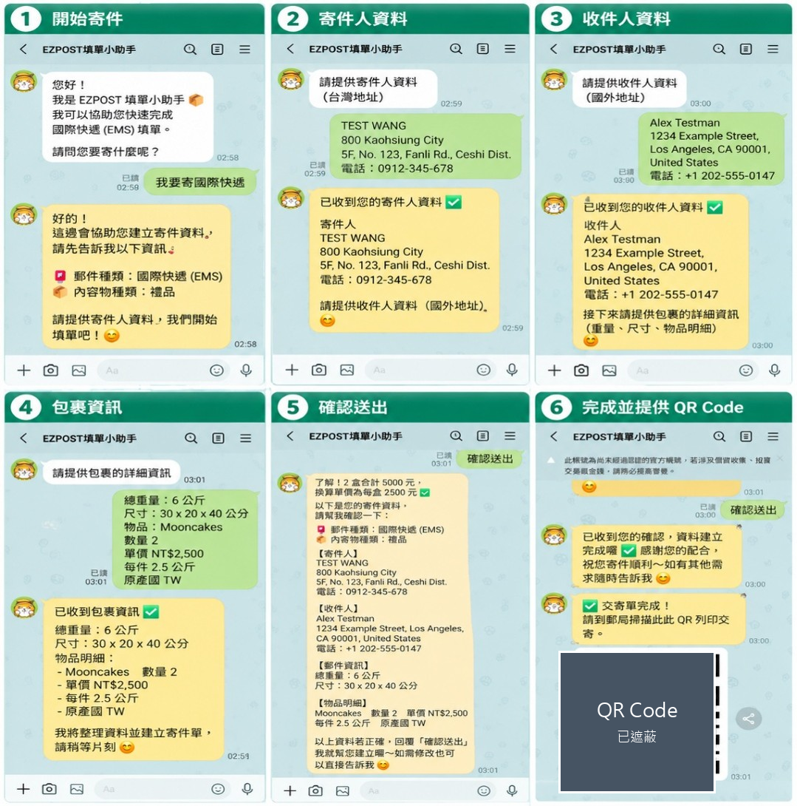
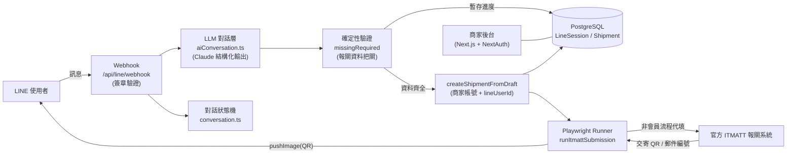

# EZPOST ITMATT 智慧填單系統

**繁體中文** ｜ [English](README.en.md)

用一段 LINE 對話取代繁瑣的國際郵件報關表單。系統以 LLM 聽懂使用者的自然語言、抽取報關欄位，經確定性驗證後由瀏覽器自動化代填官方 ITMATT 國際郵件報關系統，並將產生的交寄 QR Code 回傳至 LINE，使用者到郵局掃碼即可列印交寄。

本專案為個人作品，與任何郵政機構無隸屬關係；ITMATT 為公開的國際郵件電子通關服務。

## Demo

下圖為 LINE 上完整的對話填單流程：從開始寄件、蒐集寄件人與收件人資料、包裹資訊、送出前確認，到取得交寄 QR Code。



> 聲明：圖中所有寄件人、收件人、地址、電話與物品內容均為虛構之測試資料，不含任何真實個人資訊；畫面中的 QR Code 已遮蔽處理。

## 專案動機

國際郵件報關（ITMATT）要求寄件人逐欄填寫寄件人、收件人與每一項物品的報關明細，且須以英文、遵守各欄位的字元與格式限制。對非專業寄件者而言存在幾個痛點：

- 欄位繁雜：寄達國、州省、郵遞區號、HS code、原產國、內容分類等。
- 低容錯：報關資料填錯，郵件可能在寄達國海關被退回甚至沒收。
- 對一般消費者是高摩擦、易出錯的體驗。

目標是把入口從「一張複雜的多頁表單」改成「一段自然對話」，由系統負責理解、彙整、代填與把關。

## 系統流程

```
LINE 使用者
   │  自然語言對話
   ▼
LLM 欄位抽取（Claude 結構化輸出）
   │
   ▼
確定性驗證（欄位齊全且合法才放行）
   │
   ▼
Playwright 自動填 ITMATT（非會員流程）→ 送出
   │
   ▼
擷取交寄 QR / 郵件編號 → 回傳 LINE → 郵局掃碼列印
```

1. 使用者選擇郵件種類後，先閱讀該類別的注意事項並回覆同意，才進入資料蒐集。
2. 使用者以自然語言回答，LLM 逐步抽取寄件人、收件人、內容類別、重量尺寸與逐項物品。
3. 送出前由確定性驗證層檢查所有必填欄位；通過後才以瀏覽器自動化走 ITMATT 非會員流程代填、送出。
4. 擷取產生的交寄 QR 與郵件編號，推回使用者的 LINE。

## 系統架構



## 關鍵設計決策

- **LLM 理解 + 規則式把關的混合架構**：由 LLM（Claude 結構化輸出）負責聽懂自然語言、抽取欄位，提供友善的對話體驗；但在「送出報關」這個低容錯環節，不讓 LLM 的輸出直接放行，而是加一層確定性驗證（`missingRequired`）攔截不完整或不合法的欄位。此設計兼顧體驗與可靠度，也是本專案的核心工程判斷。
- **走 ITMATT 非會員流程**：實測確認非會員即可產單後，移除了帳密保管、登入自動化與帳號設定，大幅簡化系統與資安面。
- **逐郵件種類的注意事項同意**：不同郵件種類有不同的交寄須知，於選定種類後才顯示對應注意事項並要求同意，避免誤填。
- **資料模型對齊法規現實**：實地研究官方登打範例，把 HS code、原產國、內容分類、州省欄位等真實報關欄位建進 schema。詳見 [`docs/itmatt-fields.md`](docs/itmatt-fields.md)。
- **單一商家帳號 + 記錄 LINE userId**：所有 LINE 客人的寄件單掛在同一商家帳號下、以 `lineUserId` 標記歸屬，符合非會員代寄情境並便於回推訊息。
- **test / live 送件模式開關**：以環境變數切換「回傳示範 QR（安全、不實際送出）」與「真實送出」，便於開發驗證與正式運行分離。

## 技術棧

| 層 | 技術 |
| --- | --- |
| 前後端 | Next.js 16（App Router）、TypeScript、React |
| 資料 | Prisma ORM、PostgreSQL |
| 商家後台認證 | NextAuth v5 |
| 對話與理解 | LINE Messaging API（`@line/bot-sdk`）、Claude API（結構化輸出 + zod）、自研對話狀態機 |
| 自動化 | Playwright（瀏覽器任務執行、擷取交寄 QR） |
| 開發工具 | tsx |

## 主要功能

- LINE 引導式對話填單：LLM 聽懂自然語言、逐欄補問、多品項處理、送出前摘要確認。
- 逐郵件種類注意事項同意流程。
- 報關欄位完整：對齊 ITMATT 真實欄位（寄件人、收件人、內容物明細）。
- 瀏覽器自動化代填：Playwright 走非會員流程、送出並擷取交寄 QR。
- 商家後台：寄件人、收件人、寄件單的 CRUD 與狀態、QR 檢視。

## 本機執行

```bash
# 1. 安裝相依（因 next-auth beta 的 peer 版本，需 legacy-peer-deps）
npm install --legacy-peer-deps

# 2. 準備本機 PostgreSQL（監聽 5433，資料庫 ezpost_itmatt）
#    可使用本機安裝的 PostgreSQL 或容器，連線字串填入 .env

# 3. 設定環境變數
cp .env.example .env   # 依註解填入 DATABASE_URL、LINE 憑證、ANTHROPIC_API_KEY 等

# 4. 建立資料表與示範帳號
npx prisma db push
npm run seed

# 5. 安裝自動化所需的瀏覽器
npx playwright install chromium

# 6. 啟動
npm run dev
```

LINE webhook 需要對外可連的 HTTPS 網址（本機開發可用通道服務轉發）；`PUBLIC_BASE_URL` 需設為該對外網址，LINE 才能取得回傳的 QR 圖片。可先將 `ITMATT_SUBMIT_MODE` 設為 `test` 驗證整體流程，再切換為 `live` 進行真實送單。

也可用終端機直接測試對話：

```bash
npm run chat
```

## 專案結構

```
src/
├─ app/
│  ├─ (main)/            # 商家後台（dashboard / senders / contacts / shipments）
│  ├─ api/
│  │  ├─ line/webhook/   # LINE webhook（簽章驗證 + 事件分派）
│  │  └─ senders|contacts|shipments/  # 後台 CRUD API
│  └─ (auth)/            # 登入 / 註冊
├─ lib/
│  ├─ line/
│  │  ├─ conversation.ts     # 對話狀態機（純函式）
│  │  ├─ aiConversation.ts   # LLM 欄位抽取 + 確定性驗證把關
│  │  ├─ createShipment.ts   # 由對話 draft 建立寄件單
│  │  ├─ fulfillShipment.ts  # 送單並回傳 QR 至 LINE
│  │  └─ client.ts           # LINE API 封裝（簽章 / reply / push）
│  └─ itmatt/
│     ├─ runner.ts           # 送單流程編排
│     ├─ client.ts           # Playwright 自動化
│     └─ selectors.ts        # ITMATT 頁面選擇器
docs/itmatt-fields.md         # ITMATT 報關欄位規格（實測整理）
scripts/                      # seed（示範帳號）/ chat（終端機對話測試）
```

## 現況

- 端到端流程已完成並通過真實送單驗證：LINE 對話、LLM 欄位抽取、確定性驗證、Playwright 送出、擷取真實交寄 QR 與郵件編號、回傳 LINE。
- 已以國際快捷（EMS）與國際 e小包完成真實送單驗證。
- 其餘郵件種類（國際包裹、掛號函件、平常小包）的表單欄位對應為後續擴充項目。
