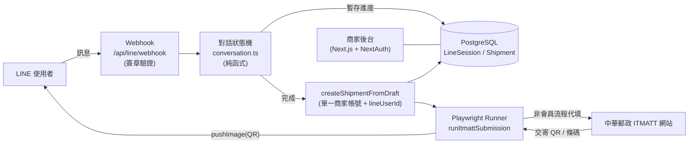

# EZPOST ITMATT 智慧填單系統

> 用一段 **LINE 對話**取代繁瑣的國際郵件報關表單，後端以**瀏覽器自動化**代填中華郵政 ITMATT 並回傳交寄 QR Code，民眾到郵局掃碼即可列印交寄。

一個從**需求釐清 → 系統設計 → 端到端落地**完整走過的個人專案，展示把真實世界的高摩擦流程，透過對話式介面與自動化重新設計的能力。

> ⚠️ 本專案為個人作品，非中華郵政官方系統；ITMATT 為公開的國際郵件電子通關服務。

---

## 為什麼做（Problem）

中華郵政 **ITMATT**（國際郵件電子通關資訊系統）要求寄件人逐欄填寫寄件人／收件人／每一項物品的報關明細，且須以英文、遵守各欄位字元限制。對非專業寄件者而言：

- 欄位繁雜（寄達國、州省、郵遞區號、HS code、原產國、內容分類…）
- **低容錯**：報關資料填錯，郵件會在寄達國海關被退回甚至沒收
- 對一般消費者是「高摩擦、易出錯」的體驗

## 怎麼設計（Solution）

把入口從「一張複雜的表單」改成「一段對話」：

```
LINE 客人 ──對話填單──▶ 對話狀態機 ──▶ Playwright 自動填 ITMATT（非會員）──▶ 擷取交寄 QR ──▶ 回傳 LINE ──▶ 郵局掃碼列印
```

1. 使用者在 LINE 上被**逐步引導**回答（郵件種類、收件人、內容類別、重量尺寸、逐項物品）
2. 系統彙整後，用瀏覽器自動化走 ITMATT **非會員流程**代為填單、送出
3. 擷取產生的交寄條碼／QR，推回使用者的 LINE
4. 使用者到有 EZPost 設備的郵局掃碼列印即可交寄

## 系統架構



## 關鍵設計決策

> 這幾點展現的是「AI 專案判斷力」——知道**何時該用、何時不該用**某個技術，比盲追流行更重要。

- **刻意不用 LLM 做開放式解析**：報關資料錯一欄就退件。評估「自由文字 + LLM 抽取」在此情境的幻覺與成本風險過高，選擇**確定性的引導式狀態機**確保可靠度；同時把架構留出可插入 LLM 語意槽位填充（slot-filling）的接縫。
- **走 ITMATT 非會員流程**：實測確認非會員即可產單後，移除了帳密加密、登入自動化與帳號設定頁，大幅簡化系統與資安面。
- **資料模型對齊法規現實**：實地研究官方登打範例，把 HS code、原產國、內容分類（禮品／銷售品／樣品…）、州省欄位等真實報關欄位建進 schema。詳見 [`docs/itmatt-fields.md`](docs/itmatt-fields.md)。
- **單一商家帳號 + 記 LINE userId**：所有 LINE 客人的寄件單掛在同一商家帳號下、以 `lineUserId` 標記歸屬，符合「非會員代寄」情境且便於回推訊息。

## 技術棧

| 層 | 技術 |
| --- | --- |
| 前後端 | Next.js 16（App Router）、TypeScript、React |
| 資料 | Prisma ORM、PostgreSQL |
| 商家後台認證 | NextAuth v5 |
| 對話層 | LINE Messaging API（`@line/bot-sdk`）、自研對話狀態機 |
| 自動化 | Playwright（agentic 瀏覽器任務執行、擷取條碼） |
| 開發 | Docker（本機 PostgreSQL）、tsx |

## 主要功能

- 🤖 **LINE 引導式對話填單**：快速回覆按鈕、逐欄驗證、多品項迴圈、送出前摘要確認
- 🧾 **報關欄位完整**：對齊 ITMATT 真實欄位（寄件人／收件人／內容物明細）
- 🕹️ **瀏覽器自動化代填**：Playwright 走非會員流程並擷取交寄 QR
- 🗂️ **商家後台**：寄件人／收件人／寄件單 CRUD、寄件單狀態與 QR 檢視

## 本機執行

```bash
# 1. 安裝相依（因 next-auth beta 的 peer 版本，需 legacy-peer-deps）
npm install --legacy-peer-deps

# 2. 啟動本機 PostgreSQL（Docker）
docker run -d --name ezpost-pg -e POSTGRES_USER=postgres \
  -e POSTGRES_PASSWORD=postgres -e POSTGRES_DB=ezpost_itmatt \
  -p 5433:5432 postgres:16

# 3. 設定環境變數
cp .env.example .env   # 依註解填入 DATABASE_URL、LINE 憑證等

# 4. 建立資料表
npx prisma db push

# 5. 啟動
npm run dev
```

## 專案結構

```
src/
├─ app/
│  ├─ (main)/            # 商家後台（dashboard / senders / contacts / shipments）
│  ├─ api/
│  │  ├─ line/webhook/   # LINE webhook（簽章驗證 + 事件分派）
│  │  ├─ senders|contacts|shipments/  # 後台 CRUD API
│  └─ (auth)/            # 登入 / 註冊
├─ lib/
│  ├─ line/              # conversation（狀態機）/ client / createShipment
│  └─ itmatt/            # Playwright 自動化（client / runner / selectors）
docs/itmatt-fields.md    # ITMATT 報關欄位規格（實測整理）
```

## 現況與 Roadmap

**已完成**
- ✅ 商家後台 CRUD、資料模型對齊 ITMATT 欄位（端到端驗證存取正確）
- ✅ LINE 對話狀態機（純函式、可單元測試，已模擬完整對話流程驗證）
- ✅ Webhook 簽章驗證、事件分派、完成時建立寄件單
- ✅ 非會員自動化框架（流程與擷取 QR 的骨架）

**進行中／待辦**
- ⏳ 接入真實 LINE channel 憑證與對外 webhook 網址（ngrok / 部署）
- ⏳ 補齊 `itmatt/selectors.ts` 對照 ITMATT 線上 DOM 的真實選擇器，串通「完成 → 自動送出 → 回傳 QR」全鏈路
- ⏳ 自動送出的佇列化與重試

---

*Built with Next.js, LINE Messaging API, and Playwright.*
